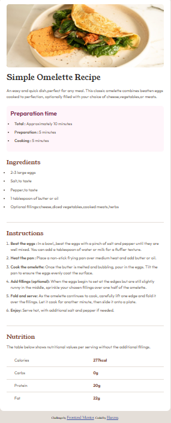

# Frontend Mentor -Solution de page de recettes

Il s'agit d'une solution au [Défi de la page de recettes sur Frontend Mentor](https://www.frontendmentor.io/challenges/recipe-page-KiTsR8QQKm). Les défis Frontend Mentor vous aident à améliorer vos compétences en codage en construisant des projets réalistes. 

## Table des matières

-[Aperçu](#aperçu)
  -[Le défi](#le-défi)
  -[Capture d'écran](#capture d'écran)
  -[Liens](#liens)
-[Mon processus](#mon-processus)
  -[Construit avec](#built-with)
-[Ce que j'ai appris](#ce que j'ai appris)
  -[Développement continu](#continued-development)
  -[Ressources utiles](#ressources-utiles)
  -[Collaboration IA](#ai-collaboration)
-[Auteur](#auteur)
-[Remerciements](#reconnaissances)


## Aperçu

Création d'une page de recette proposé par Frontend Mentor. 

### Capture d'écran



### Liens

-URL de la solution : [Ajoutez l'URL de la solution ici](https://votre-solution-url.com)
-URL du site en direct : [Ajoutez l'URL du site en direct ici](https://your-live-site-url.com)

## Mon processus

J'ai réalisé ce projet de recette de la manière suivante:

### Construit avec

-HTML 5 Sémantique pour la mise en page du recette
-Accessibilité avec les concepts d'ARIA
-CSS Flexbox pour le centrage du contenu
-CSS :hover et :focus pour l'effet au survol et l'accessibilité au clavier


### Ce que j'ai appris
Dans ce projet , j'ai pu acquérir les compétences suivantes :

-Accessibilité avec ARIA

```html
<article aria-label="Simple Omelette Recipe">
<section id="preparation" aria-labelledby="preparation-title">
<section id="ingredients" aria-labelledby="ingredients-title">
<hr aria-hidden="true">
<section id="instructions" aria-labelledby="instructions-title">
```
-La manipulation des tableaux

```html
<table class="nutrition__table">
          <tbody>
            <tr>
              <th scope="row">Calories</th>
              <td>277kcal</td>
            </tr>
            <tr>
              <th scope="row">Carbs</th>
              <td>0g</td>
            </tr>
            <tr>
              <th scope="row">Protein</th>
              <td>20g</td>
            </tr>
            <tr>
              <th scope="row">Fat</th>
              <td>22g</td>
            </tr>
          </tbody>
        </table>
```
-La manipulation des tableaux avec le CSS

```css
table{
    border-collapse: collapse;
    width: 100%;
}

table th{
    font-family: var(--font-family-paragraph);
    font-weight: 400;
    color: var(--paragraph-color);
   text-align: left;
   padding: 0.75rem 2rem;
   width: 50%;
}

table td{
    font-family: var(--font-family-paragraph);
    font-weight: 700;
    color: var(--title-color);
    width: 50%;
    padding: 0.75rem 2rem;
}

table tr{
    border-bottom: 1px solid hsl(30, 18%, 87%);
}

table tr:last-child{
    border: none;
}

```
### Développement continu

J'ai pu acquérir la compétence d'ARIA dans ce projet mais je voudrais aller encore plus loin. 
Dans le prochain défi , j'utiliserai de mieux en mieux les concepts d'ARIA seulement s'il est nécéssaire. J'essayerai aussi d'ajouter le CSS Grid si le défi en contient.

### Ressources utiles

-[MDNWebDocs](https://developer.mozilla.org/en-US/) -C'est l'endroit qui m'a permis de comprendre et d'explorer le concept d'accessibilité
-[W3Schools](https://www.w3schools.com/) -Ceci est mon terrain pour apprendre et coder en même temps.

### Collaboration IA

J'ai collaboré avec les IA de la manière suivante:

-J'ai utilisé les IA Claude et Chatgpt dans ce projet
-Ils m'ont aidés à corriger des erreurs qui bloquaient le résultat de ma page


## Auteur

-Site Web -[Harena](https://github.com/Harena-debug)
-Mentor Frontend -[@ Harena-debug](https://www.frontendmentor.io/profile/Harena-debug)

## Remerciements

Un grand merci à Frontend Mentor qui m'a proposé ce défi afin de m'éxercer dans la pratique du HTML CSS. Un grand merci aussi aux 
mentorat dans Frontend Mentor qui m'ont corrigé et m'ont donnés la bonne voie pour le bon codage en HTML CSS.